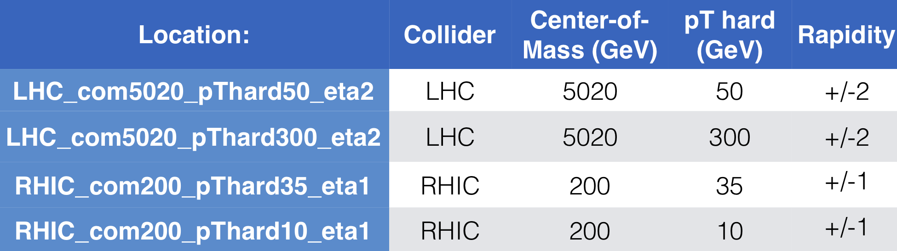

## HERWIG

4 datasets located at: `/lustre/emmi/emmi06/herwig/*_com*_pThard*_eta*/hepmc*`

Dijet tunes, configurations: `/lustre/emmi/emmi06/herwig/*.in`

Each sample has 100 HepMC2 files with 10,000 events = • 1,000,000 events total

Shower history is included in all the files but there is no
status to indicate the hard scattering (as far as I can tell)

Contacts: Laura Havener + Leticia Cunqueiro
