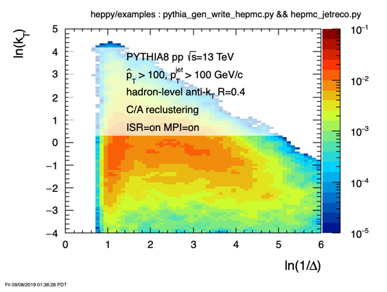

# Analysis Software 

<hr>

# FASTJET, HEPMC, LHAPDF, PYTHIA with python - HepPy

- [https://github.com/matplo/heppy](https://github.com/matplo/heppy)
- installed at GSI in emmi01 user dir

## load the modules
```
module use /u/emmi01/rrtf/heppy/modules
module load heppy/main_python
```

- see what's loaded
```
module list
```

- the following (or alike) should be displayed

```
Currently Loaded Modulefiles:
  1) heppy/heppy_python            4) heppy/python/HEPMC3/3.1.1     7) heppy/python/FASTJET/3.3.2
  2) heppy/python/LHAPDF6/6.2.3    5) heppy/python/ROOT/6.18.00     8) heppy/python/cpptools/1.0
  3) heppy/python/HEPMC2/2.06.09   6) heppy/python/PYTHIA8/8235     9) heppy/main_python
```

### Note

You do not need to use python. You can compile your C++ code against these libraries - these are fully functional packages that you can use for other purposes 
- for example typing `root -l -b` will open a root session... 
- if you want to use these to build other software - lookup the module file or use the `env | grep` - for example:

```
> env | grep HEPPY
HEPPY_PYTHON_VERSION=2.7
HEPPYDIR=/u/emmi01/rrtf/heppy
HEPPY_PYTHON_LIBDIR=/usr/lib
HEPPY_PYTHON_INCLUDE_DIR=/usr/include/python2.7
HEPPY_PYTHON_SETUP=TRUE
HEPPY_PYTHON_EXECUTABLE=/usr/bin/python
HEPPY_PYTHON_CONFIG_LDFLAGS=-L/usr/lib/python2.7/config-x86_64-linux-gnu -L/usr/lib -lpython2.7 -lpthread -ldl -lutil -lm -Xlinker -export-dynamic -Wl,-O1 -Wl,-Bsymbolic-functions
HEPPY_PYTHON_LIBS=-lpython2.7 -lpthread -ldl -lutil -lm
HEPPY_PYTHON_LIBS_LINK=-L/usr/lib -lpython2.7 -lpthread -ldl -lutil -lm
HEPPY_PYTHON_MODULE_LOADED=heppy/heppy_python
HEPPY_PYTHON_BIN_DIR=/usr/bin
HEPPY_PYTHON_NUMPY_INCLUDE_DIR=/usr/lib/python2.7/dist-packages/numpy/core/include
HEPPY_USER_PYTHON_VERSION=python
HEPPY_PYTHON_CONFIG_INCLUDES=-I/usr/include/python2.7 -I/usr/include/x86_64-linux-gnu/python2.7
HEPPY_DIR=/u/emmi01/rrtf/heppy
HEPPY_ROOT=/u/emmi01/rrtf/heppy
```

- nuclear PDFs installed: EPPS16nlo_CT14nlo_Pb208, EPPS16nlo_CT14nlo_Au197

```
> lhapdf show EPPS16nlo_CT14nlo_Pb208
EPPS16nlo_CT14nlo_Pb208
=======================
LHAPDF ID: 901300
Version: 1
EPPS16+CT14nlo, 2-loop PDF evolution with HOPPET and HOPPET alphas_s running solution. In total 97 member PDFs. mem=0 --> central value; mem=1-96 --> eigenvector sets 90%. For more info, visit https://www.jyu.fi/fysiikka/en/research/highenergy/urhic/EPPS16%20download
Number of members: 97
Error type: hessian

> lhapdf show EPPS16nlo_CT14nlo_Au197
EPPS16nlo_CT14nlo_Au197
=======================
LHAPDF ID: 901200
Version: 1
EPPS16+CT14nlo, 2-loop PDF evolution with HOPPET and HOPPET alphas_s running solution. In total 97 member PDFs. mem=0 --> central value; mem=1-96 --> eigenvector sets 90%. For more info, visit https://www.jyu.fi/fysiikka/en/research/highenergy/urhic/EPPS16%20download
Number of members: 97
Error type: hessian
```


## try examples

- note: examples use a progress bar - run the command below
```
pip install tqdm --user
```

- also rather soon you will need numpy and pandas
```
pip install numpy pandas array --user
```

### generate some pythia events and on-the-fly run fastjet, de-cluster into Lund, soft-drop ...

```
/u/emmi01/rrtf/heppy/examples/pythia_gen_fastjet_lund_test.py
```

- code on github: [https://github.com/matplo/heppy/blob/master/examples/pythia_gen_fastjet_lund_test.py](https://github.com/matplo/heppy/blob/master/examples/pythia_gen_fastjet_lund_test.py)

### generate some pythia events and write a hepmc2 file

```
/u/emmi01/rrtf/heppy/examples/pythia_gen_write_hepmc.py
```

   - code on github: [https://github.com/matplo/heppy/blob/master/examples/pythia_gen_write_hepmc.py](https://github.com/matplo/heppy/blob/master/examples/pythia_gen_write_hepmc.py)

### read the hepmc2 file and run a jet finder....

- note for this step you will need an extra package - one time command...(don't worry if you see a red printout about pybind11 -- it worked successfully)

```
pip install pybind11 --user
pip install pyhepmc_ng --user
```

- if you are unable to install pybind11 and the pyhepmc_ng there is a workaround (happened to one of the participants) - don't despair, stay calm and proceed - there is a hack for that... do this:

```
cp -r /u/emmi01/.local $HOME
```

AND add these lines to your $HOME/.bashrc

```
if [ -z ${PATH} ]; then
    export PATH=$HOME/.local/bin
else
    export PATH=$HOME/.local/bin:$PATH
fi
```

start a new session (logout or bash...) then you should be all set...

- now run the jet finding on the hepmc file:

```
/u/emmi01/rrtf/heppy/examples/hepmc_jetreco.py --hepmc 2 -i ./pythia_gen_test_hepmc2.dat
```

   - code on github: [https://github.com/matplo/heppy/blob/master/examples/hepmc_jetreco.py](https://github.com/matplo/heppy/blob/master/examples/hepmc_jetreco.py) - run for 1000 events (use: `--nev=1000` switch) produces a Lund Plane as below...



- or run on jetscape events, and save a ROOT histogram:

```
/u/emmi01/rrtf/heppy/examples/hepmc_jetscape_jetreco.py -i /lustre/emmi/emmi02/jetscape/PP_2760_50_colored/1/test_out.hepmc
```
   - code on github [https://github.com/matplo/heppy/blob/master/examples/hepmc_jetscape_jetreco.py](https://github.com/matplo/heppy/blob/master/examples/hepmc_jetscape_jetreco.py)

- Liliana reported that the q-pythia generated hepmc2 does not work... another wrapper was added - an example usage:

```
$HEPPYDIR/examples/hepmc_qpythia_jetreco.py -i /u/emmi08/qpythia_qhat2_1.hepmc
```
   - code on github [https://github.com/matplo/heppy/blob/master/examples/hepmc_qpythia_jetreco.py](https://github.com/matplo/heppy/blob/master/examples/hepmc_qpythia_jetreco.py)


## pre-requisite for compilation

- we use a bit more updated CMake to compile things... - custom installed

```
module use /u/emmi01/software/hepsoft/modules
module load cmake/3.15.1
```

### more items coming up...

<hr>

[Back to EMMI-Jet-RRTF](index.md)
